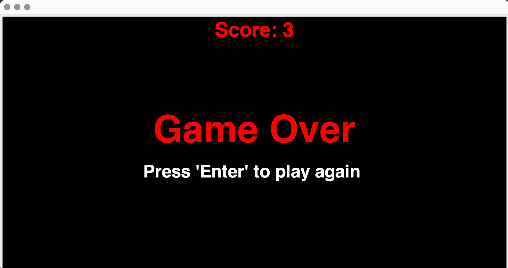

# SnakeGame

## Table of Contents

- [Description](#description)
- [Game Features](#game-features)
- [How to Play](#how-to-play)
- [Contributing](#contributing)
- [License](#license)

## Description

This is a simple Snake game built in Java. It's a classic arcade-style game where the player controls a snake that moves around the screen, collecting food to grow while avoiding collisions with the wall or itself. The goal is to achieve the highest score possible by eating as much food as you can without crashing.

## Game Features

- Classic Snake gameplay.
- Score tracking.
- Game over screen with the option to restart.

## How to Play

- Use the arrow keys on your keyboard (Up, Down, Left, Right) to control the snake's direction.
- The snake will continuously move in the current direction.
- Collect the food items (represented by dots) to grow your snake and earn points.
- Avoid hitting the walls or colliding with the snake's own body.
- The game ends when the snake crashes into a wall or itself & you can restart using 'Enter'.
- Try to achieve the highest score possible!

## License

@author: Nurjahan Shiah

---

